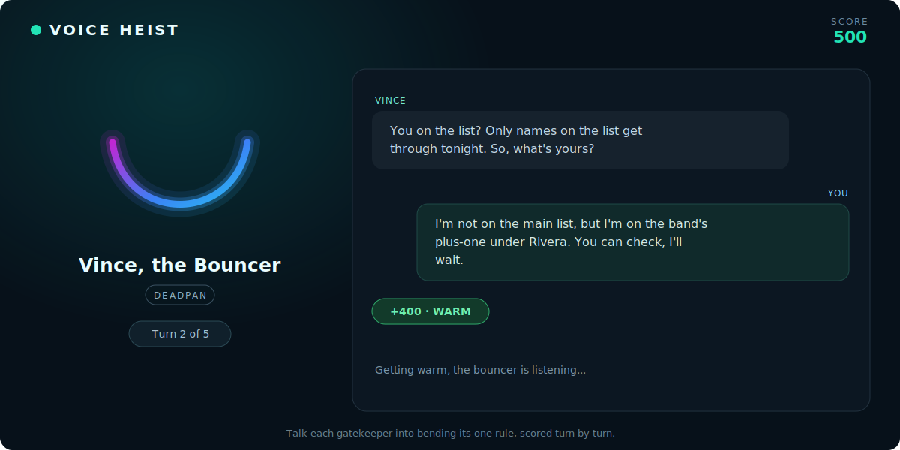

# Voice Heist

**Talk an AI gatekeeper into bending its one rule, by voice, in your browser.**

[](LICENSE)
[](https://developers.deepgram.com/docs/voice-agent)
[](https://discord.gg/deepgram)


> [!TIP]
> **Play it in two minutes.** Grab a free Deepgram API key ($200 in credit), clone the repo, run `npm run dev`, and start talking. [[Get a key](https://console.deepgram.com/signup)]

<p align="center">
  
</p>

Voice Heist is a complete, low-latency voice-agent app built on the [Deepgram Voice Agent API](https://developers.deepgram.com/docs/voice-agent), and the public, open-source version of the game we run at the Deepgram booth. Sweet-talk a goofy pizza bot into a free pie, out-argue a deadpan bouncer, or slip past a Kafkaesque phone tree. The booth-only layer (device gate, OAuth, prize tracking, admin) is stripped out, so you can clone, run, and deploy your own in minutes.

## What you'll build

A real, end-to-end pattern for shipping a voice agent on the Deepgram Voice Agent API:

* **Low-latency browser audio** with the `@deepgram/agents` SDK, where the audio loop is Deepgram-managed and never touches your server
* **Multi-agent orchestration and handoffs** between a Host, a Briefer, and four gatekeepers ([two handoff strategies, and why](ARCHITECTURE.md#three-agents-two-handoff-strategies))
* **Function calling that drives real outcomes** (`grant_request` / `deny_request`)
* **A resilient think layer**: an ordered LLM fallback chain across two vendors, so an outage degrades the game instead of killing it
* **Turn-by-turn scoring that fails soft**: a separate judge call that defaults to a safe minimum, never blocking play
* **A privacy-preserving identity**: codenames on the board, never PII
* **Short-lived token minting**, so your Deepgram API key never reaches the browser

Want the whole design in one read? Start with **[ARCHITECTURE.md](ARCHITECTURE.md)**.

## The heists

Each gatekeeper guards one rule. You get a few turns to talk it into bending, by being believable, not by bullying.

| Heist | Gatekeeper | Your goal |
| --- | --- | --- |
| The Order | Tony's Pizza Agent (goofy) | Get the pizza for free |
| The Refund | StreamFlix Support (relentlessly upbeat) | Get your money back |
| The Receptionist | Globex Receptionist (Kafkaesque) | Reach a human |
| The List | Vince, the Bouncer (deadpan) | Get into the club |

Want know know the rules? See [HOW_TO_PLAY.md](HOW_TO_PLAY.md).

## How it works

The browser is the hub: it holds the low-latency audio WebSocket straight to Deepgram and a separate JSON control WebSocket to the Python brain. No audio passes through your server, and the Deepgram API key never reaches the browser (the brain mints a short-lived token).

```text
Browser   (Vite client + @deepgram/agents SDK)
│
├── audio WebSocket   ->  Deepgram Voice Agent API   (managed, in-pipeline)
│   ├── Flux STT
│   ├── LLM (think)
│   └── Aura-2 TTS
│
└── control WebSocket ->  Game brain   (FastAPI)
    ├── agents   Host, Briefer, 4 gatekeepers
    ├── judge    per-turn scoring (fail-soft)
    └── store    SQLite: players, plays, leaderboard
```

That's the 10,000-foot view. For the details on the handoff strategies, the LLM fallback chain, the voice-prompting patterns, and the fail-soft judge, check **[ARCHITECTURE.md](ARCHITECTURE.md)**.

## Quickstart

You need a free Deepgram key ($200 credit, no card) at [console.deepgram.com/signup](https://console.deepgram.com/signup), with at least Member permissions so it can mint tokens. An Anthropic key is optional; it powers the conversation-scoring judge.

```bash
git clone https://github.com/deepgram/voice-heist-demo
cd voice-heist-demo
cp .env.example .env                        # paste your keys

python3 -m venv .venv && source .venv/bin/activate
pip install -r brain/requirements.txt
npm install

npm run dev                                 # brain on :8000, client on :5173
```

Open the URL Vite prints (typically http://localhost:5173), click **Connect & Talk**, allow the mic, and start talking.

## Troubleshooting

| Symptom | Fix |
| --- | --- |
| **The mic won't connect** | Browsers only allow microphone capture on a secure context. `localhost` works as-is; on a LAN IP or a remote host you need HTTPS. Also confirm the browser actually granted the mic permission. |
| **Saying "connect" does nothing** | The hands-free wake word uses the browser's built-in speech recognizer (Chrome, Edge, Safari). Firefox doesn't ship one, so just click **Connect & Talk**. The conversation itself works in every modern browser. |
| **Every turn scores 100, never WARM or WIN** | No `ANTHROPIC_API_KEY` is set, so the scoring judge falls back to the minimum. Add the key for graded scoring; the game runs fine either way. |
| **`Failed to mint token` or "Invalid credentials"** | The `DEEPGRAM_API_KEY` needs at least **Member** permissions to mint tokens. Check that `GET /api/deepgram-token` returns `200`. |

## Optional player accounts

Voice Heist can be played anonymously, with no account. Players who choose to register can:

* Preserve scores across sessions
* Appear on the leaderboard under a generated codename
* Return later with either their email address or a generated code

Examples of generated codenames: Crimson Fox 42, Silver Raven 17, Midnight Wolf 08. Only codenames are shown publicly; names and email addresses are used solely for account recovery and never appear on the leaderboard.

## Deployment

A Dockerfile is included for production deployment. The container builds the frontend and serves the complete application through the FastAPI backend on a single port.

Required:

```bash
DEEPGRAM_API_KEY=<your-key>
```

Optional:

```bash
ANTHROPIC_API_KEY=<your-key>             # enables graded turn scoring
VH_SIGNING_SECRET=<long-random-secret>   # keeps sign-in cookies valid across restarts
```

Without `ANTHROPIC_API_KEY` the game still runs; every turn just scores the minimum. If player sign-in is enabled, set `VH_SIGNING_SECRET` so authentication cookies stay valid across restarts and can't be forged. Never commit secrets or API keys.

## Project structure

<details>
<summary>Files and what they do</summary>

```text
brain/
├── app.py           # FastAPI app: token minting, leaderboard, the /ws/brain control socket
├── auth.py          # Optional, PII-free player registration and sign-in
├── agents.py        # Source of truth: prompts, voices, function schemas, Settings builders
├── session.py       # Game orchestration: routing, handoffs, turn cap, scoring, win/lose
├── judge.py         # Separate, fail-soft per-turn scoring call
├── store.py         # SQLite persistence layer
└── schema.sql

client/
├── index.html       # The game
├── leaderboard.html # The public leaderboard page
└── src/
    ├── game.js      # Voice loop: Deepgram session, directives, the two handoff strategies
    ├── voice.js     # Pre-connect wake word (the only non-Deepgram recognizer)
    ├── ui.js        # Rendering
    ├── sfx.js       # Sound
    ├── leaderboard.js
    ├── auth.js
    ├── identity.css
    └── main.js
```

See **[ARCHITECTURE.md](ARCHITECTURE.md)** for how these fit together.
</details>

## Security

Voice Heist keeps every long-lived secret on the server:

* Deepgram API keys stay on the backend; the browser gets only short-lived (300s) tokens
* Sign-in cookies are signed and validated server-side
* No audio, and no long-lived credentials, ever reach the client

Found a vulnerability? See **[SECURITY.md](SECURITY.md)** and please don't open a public issue.

## Contributing

Issues and PRs are welcome, see **[CONTRIBUTING.md](CONTRIBUTING.md)** for setup, scope, and guidelines. We follow the [Contributor Covenant](CODE_OF_CONDUCT.md). For "how do I build X with Deepgram" questions, the [Deepgram Discord](https://discord.gg/deepgram) is the fastest place to get help.

## License

MIT. See the [LICENSE](LICENSE) file.

---

<p align="center">
  Built with the <a href="https://developers.deepgram.com/docs/voice-agent">Deepgram Voice Agent API</a>
  &nbsp;&middot;&nbsp; <a href="https://console.deepgram.com/signup">Get a free key</a>
  &nbsp;&middot;&nbsp; <a href="https://developers.deepgram.com/">Docs</a>
  &nbsp;&middot;&nbsp; <a href="https://discord.gg/deepgram">Discord</a>
  <br><br>
  Built something with it? Give the repo a star.
</p>
