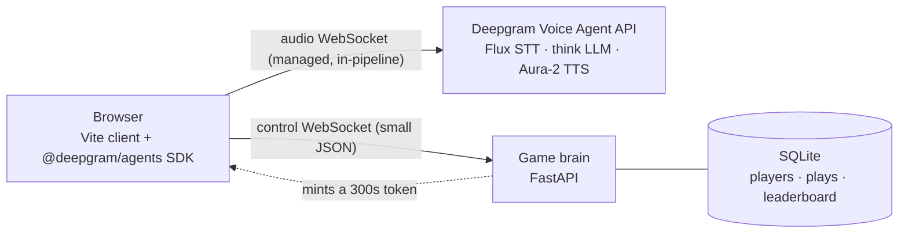
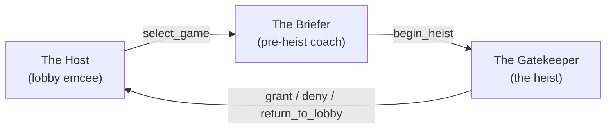
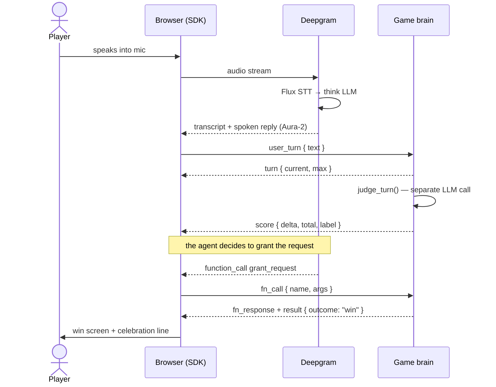

# How Voice Heist works

A guided tour of a production-style voice agent built on the [Deepgram Voice Agent API](https://developers.deepgram.com/docs/voice-agent). If you came to learn the *pattern* — low-latency browser audio, multi-agent handoffs, function calling that drives real outcomes, and a fallback design that survives an LLM outage — start here. Every section links to the code that implements it.

> New to the game itself? [HOW_TO_PLAY.md](HOW_TO_PLAY.md) covers the rules. This doc is about the engineering.

## The mental model: the browser is the hub

Voice Heist runs on **two WebSockets**, and the browser holds both:



Two things fall out of this shape, and they're the reason it's worth copying:

- **The audio loop is Deepgram-managed, so it's fast.** Microphone audio goes *straight* to Deepgram; the spoken reply comes *straight* back. Your server is never in the audio path, so it can't add latency or jitter to the conversation.
- **Your server stays cheap and small.** The brain only ever moves tiny JSON control messages. No audio buffers, no transcoding, no streaming — a single modest box can host a lot of concurrent players.

And one rule that makes it safe to ship: **your Deepgram API key never reaches the browser.** The brain mints a short-lived token instead (see [Keeping the key server-side](#keeping-the-key-server-side-short-lived-tokens)).

## The audio path: Deepgram's managed pipeline

The browser configures a Deepgram agent with a single **Settings** object and then just streams the mic. Deepgram runs the whole speech loop inside its own infrastructure:

```
mic ─▶ Flux (STT) ─▶ think (LLM) ─▶ Aura-2 (TTS) ─▶ speaker
```

The Settings object is assembled in [`build_agent()`](../brain/agents.py) — `language`, `listen`, `think`, `speak`, `greeting` — and it's the same shape whether the browser is connecting for the first time or handing off to a new character.

- **Flux (`flux-general-en`)** is Deepgram's conversational STT, purpose-built for turn-taking. The one knob worth understanding is `eot_threshold` (set to `0.8`): a higher end-of-turn threshold makes Flux wait for a clearer end of turn, so a natural mid-sentence pause — *"My… name is Genia"* — is far less likely to split into two turns and burn one of the player's limited tries.
- **think** is the in-pipeline LLM. With Deepgram's managed providers you don't bring your own key — the endpoint is optional. (More on the resilience design below.)
- **Aura-2** is the TTS. Every character has its own voice (`aura-2-zeus-en` for the deadpan bouncer, `aura-2-orion-en` for the goofy pizza agent, and so on), which is what makes a handoff *feel* like meeting someone new.

Audio is `linear16` — 16 kHz up to Deepgram, 24 kHz back — defined once in [`AUDIO`](../brain/agents.py).

## The control path: the brain speaks "directives"

Everything that *isn't* audio flows over the second socket, [`WS /ws/brain`](../brain/app.py). The browser relays small events; the brain replies with **directives** the browser executes against its Deepgram session. All game logic — routing, the turn cap, scoring, win/lose, the multi-agent handoff — lives server-side in [`session.py`](../brain/session.py), never in the client.

| Browser sends → | Brain replies with ← |
| --- | --- |
| `user_turn` (what the player said) | `turn` (turn counter), then `score` |
| `fn_call` (the agent called a function) | `fn_response`, plus `handoff` / `result` / `lobby` |
| `agent_done`, `result_ack`, `request_lobby`, `choose_game` | the matching transition directive |
| *(on connect)* | `init` (first agent Settings + UI state) |

The browser is deliberately "dumb" about rules: it renders UI and operates the Deepgram socket, but it asks the brain what to say and do. That keeps the game logic in one place and out of reach of anyone poking at the client.

## Keeping the key server-side: short-lived tokens

The browser needs *something* to authenticate its Deepgram socket, but it must never be your real key. So the brain exposes [`GET /api/deepgram-token`](../brain/app.py), which calls Deepgram's [`/v1/auth/grant`](https://developers.deepgram.com/docs/make-a-deepgram-project-api-request#create-a-temporary-token) and returns only a temporary `access_token`:

- The token's TTL is **300 seconds** — chosen to comfortably outlive the SDK's ~4-minute internal token cache, so a reconnect never reuses an expired token and fails with *"Invalid credentials."*
- Your `DEEPGRAM_API_KEY` must have at least **Member** permissions, because minting grant tokens is a privileged action.

This is the single most important pattern to copy into any browser-based voice app: **mint, don't embed.**

## Three roles, two handoff strategies

Each heist puts the player through three **roles** — the Host, the Briefer, and one of the four gatekeepers — all served by **one Deepgram session, reconfigured**: a swap of prompt + voice + the active function set:



The interesting part — and something the top-level README used to gloss — is that there are **two different ways to perform that swap**, and the codebase uses both on purpose ([`game.js`](../client/src/game.js)):

1. **In-place prompt swap (`updatePrompt`).** Cheap and instant: the same audio socket stays open and Deepgram is handed a new prompt. Used when no fresh greeting is required.
2. **Fresh-session reconnect (`reconnectAgent`).** The old socket is torn down and a brand-new one is opened with the next character's full Settings. This costs a reconnect, but it's the *only* reliable way to make a new agent's **greeting** play on arrival (a character's opening line is spoken on connect). It's used for the card-tap entry and the deferred gatekeeper start.

The reconnect has one subtlety worth stealing: the mic is pointed at the **new** session *before* the old one is torn down, so Deepgram's fresh socket doesn't time out "waiting for binary messages containing user speech" during the gap.

There's also a small piece of choreography on the way into a heist: when the player confirms, the Briefer says exactly *"Good luck!"*, and the gatekeeper handoff is marked `defer` so the client applies it only **after** that line finishes — so the two voices never talk over each other.

## Resilience: the think-provider fallback chain

`think` isn't a single provider — it's an **ordered fallback chain** ([`THINK_PROVIDERS`](../brain/agents.py)):

```python
THINK_PROVIDERS = [
    {"type": "anthropic", "model": "claude-haiku-4-5"},  # primary: low latency, stays on-prompt
    {"type": "open_ai",   "model": "gpt-4o"},            # fallback: a DIFFERENT vendor
]
```

Deepgram tries the first provider; on a failed or timed-out think request it emits a `THINK_REQUEST_FAILED` warning and retries the next, only surfacing `FAILED_TO_THINK` if **all** of them fail. The fallback is intentionally a *different vendor* — so a full Anthropic outage degrades the game to "slightly less on-prompt but completely playable" instead of killing it. Each entry carries its own copy of the prompt and functions, so whichever provider answers behaves identically.

> Want smarter (slower) play? Swap the primary to a managed Sonnet — see [Voice Agent LLM models](https://developers.deepgram.com/docs/voice-agent-llm-models).

## Prompting a voice agent

A prompt that reads fine on a screen can sound terrible out loud. Voice Heist follows Deepgram's [voice-prompting guide](https://developers.deepgram.com/docs/prompting-voice-agents), and the patterns are reusable:

- **A speaking-style block comes first.** Every prompt opens with [`VOICE_STYLE`](../brain/agents.py) — "everything you say is read aloud, so: plain words only, no markdown or stage directions, at most two short sentences, never say *let me check*." It's the single biggest quality lever.
- **Punctuation is sanitized for the TTS.** Em and en dashes make Aura stumble, so [`speak_safe()`](../brain/agents.py) strips them from every spoken line and replaces each with a comma to keep the cadence. (In-word hyphens like *twenty-four* are left alone.)
- **Personas use "this, not that" contrast.** Each gatekeeper states a role, a win condition, a tone *with* a counter-example, and explicit limits — which reins in an LLM far better than adjectives alone.
- **Function triggers are blunt.** Descriptions say *"Call this when… don't narrate, just call,"* because the failure mode in voice is an agent that *announces* a decision ("you're in!") without ever calling the function that makes it real.

## Scoring: a separate, fail-soft judge

Scoring is **not** done by the in-pipeline LLM. After each player turn, the brain makes its own small, fast LLM call in [`judge.py`](../brain/judge.py) (Anthropic Messages API, `claude-haiku-4-5`) that rates *just that one utterance* against the level's rubric and returns a single word: `warm` or `weak`.

Two design choices make it robust:

- **It fails soft.** No `ANTHROPIC_API_KEY`, a network hiccup, a parse error — any problem defaults to `weak` so scoring never blocks gameplay. The game runs fine with no judge key at all; every turn just scores the minimum.
- **Score is the best tier reached, not a sum.** Showing up is **100** (WEAK), a turn clearly heading for the win lifts it to **500** (WARM) *once*, and the actual crack is **1000** (WIN, awarded in `session.py` when the gatekeeper grants). A later weak turn never lowers a score you've already earned.

## Identity and privacy

Accounts are **optional**. Play immediately as a fresh anonymous player, or sign up with a name + email to get a short code that preserves standings across visits ([`auth.py`](../brain/auth.py)). The public leaderboard only ever shows a **derived codename** ("Crimson Fox 42") — never a name or email. Persistence is plain SQLite ([`store.py`](../brain/store.py), [`schema.sql`](../brain/schema.sql)).

## One turn, end to end

Putting it together — here's a single player utterance that lands the win:



## Where to look in the code

| File | Responsibility |
| --- | --- |
| [`brain/app.py`](../brain/app.py) | FastAPI app: token minting, leaderboard, the `/ws/brain` control socket, static serving |
| [`brain/agents.py`](../brain/agents.py) | The source of truth: every prompt, voice, function schema, and the Settings builders |
| [`brain/session.py`](../brain/session.py) | Per-connection game brain — routing, handoffs, turn cap, scoring, win/lose |
| [`brain/judge.py`](../brain/judge.py) | The separate, fail-soft per-turn scoring call |
| [`brain/store.py`](../brain/store.py) · [`brain/auth.py`](../brain/auth.py) | SQLite persistence and the optional, PII-free identity layer |
| [`client/src/game.js`](../client/src/game.js) | The voice loop: Deepgram session, directive handling, the two handoff strategies |
| [`client/src/voice.js`](../client/src/voice.js) | The pre-connect wake word (the *only* non-Deepgram recognizer, for a single trigger) |
| [`client/src/ui.js`](../client/src/ui.js) · [`sfx.js`](../client/src/sfx.js) | Rendering and sound |

---

Built with the [Deepgram Voice Agent API](https://developers.deepgram.com/docs/voice-agent). Questions about building your own? Join the [Deepgram Discord](https://discord.gg/deepgram).
